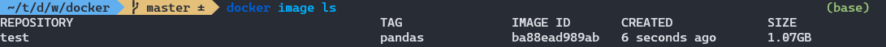
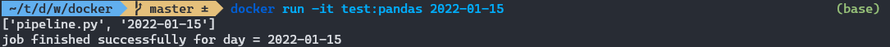
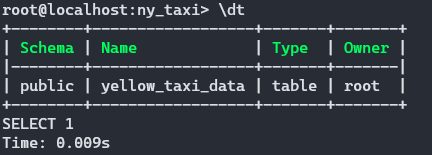
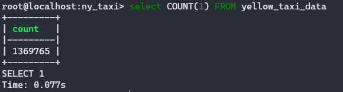
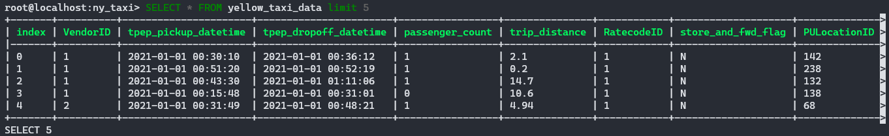
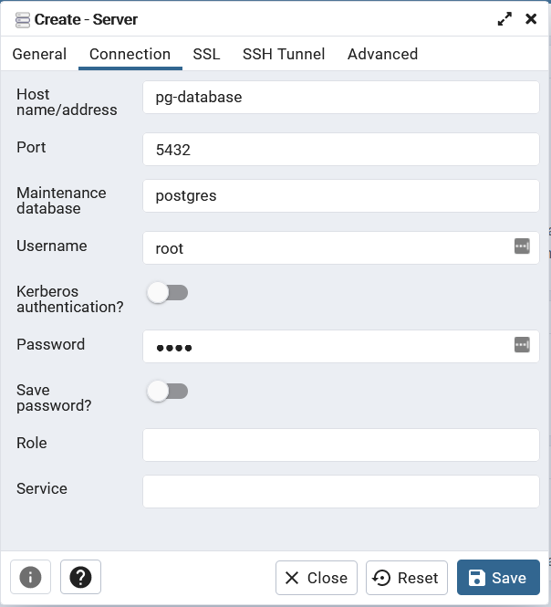
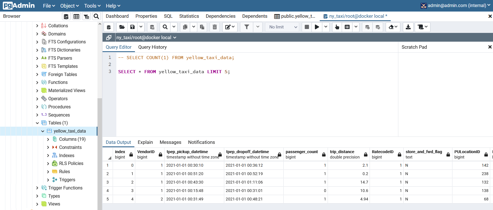

# Docker and PostgreSQL 
## Simple docker pipeline example
With the [Dockerfile](Dockerfile) and [pipeline script](pipeline.py) in this directory, build and run the container with the following commands.

First build the image:

```bash
docker build -t test:pandas .
```

We can check that the image was built with the following command:

```bash
docker image ls
```



Run the container with the command line argument of a date. Because the image entrypoint was defined in the Dockerfile as `["python", "pipeline.py"]`, running the container will execute the python script. The pipeline.py script will print out the `sys.argv` and a success message containing the date that was entered as the command line argument.

```bash
docker run -it test:pandas 2022-01-15
```




## Running Postgres in Docker

We can also create a database that runs in a container using the Postgres docker image. The following command will create a postgres database running locally within a container. Note that I'm using the fish shell. Referencing the `volume` path on the host machine (ie `-v (pwd)/ny_taxi...`) will vary depending on the OS and shell. By defining this volume, data will persist outside of the container.

```bash
docker run -it \
  -e POSTGRES_USER="root" \
  -e POSTGRES_PASSWORD="root" \
  -e POSTGRES_DB="ny_taxi" \
  -v (pwd)/ny_taxi_postgres_data:/var/lib/postgresql/data \
  -p 5432:5432 \
  postgres:13
```

To access the database, use the command line interface `pgcli`. It can be installed via `pip`. I had it installed already, but it was an old version, so I updated it with the command `pip install -U pgcli`. To connect `pgcli` to the database use the parameters for username, port, and database name that were defined in the environment variables of the docker container.

```
pgcli -h localhost -p 5432 -U root -d ny_taxi
```

## Adding data to the database with Python
Currently there is no data in the database, but we will add some using Python. The dataset that will be used for the course is the [NYC Taxi Dataset](https://www1.nyc.gov/site/tlc/about/tlc-trip-record-data.page) maintained by the NYC Taxi and Limousine Commission that includes data on taxi trips in the city. 

Data for January 2021 can be downloaded with `wget`:

``` 
wget https://s3.amazonaws.com/nyc-tlc/trip+data/yellow_tripdata_2021-01.csv
```

As well as a data dictionary describing the columns and a zone lookup table

```
wget https://www1.nyc.gov/assets/tlc/downloads/pdf/data_dictionary_trip_records_yellow.pdf
wget https://s3.amazonaws.com/nyc-tlc/misc/taxi+_zone_lookup.csv
```

There are about 1.4 million rows in the table.
```
> wc -l yellow_tripdata_2021-01.csv 32
1369766 yellow_tripdata_2021-01.csv
```

The notebook [`upload_data.ipynb`](upload_data.ipynb) contains Python code to connect to the locally running Postgres database using [SQLAlchemy](https://www.sqlalchemy.org/), read the csv, convert pickup and drop off time fields from text to datetime, define the schema of the table using [DDL](https://techterms.com/definition/ddl), create the table, and write all the data to the database. I also added the zones table to the database.

Once it's done, we can access the data in Postgres using `pgcli`. The `\dt` command in postgres is used to list tables:



All 1,369,765 rows are in there:



Viewing the top 5 rows:



## Running pgAdmin - a graphical management tool for PosgtreSQL

Having the command line tool is great for running simple checks on the data, but for more convenient usage, we need a graphical interface to interact with our database. Enter [pgAdmin](https://www.pgadmin.org/). And with Docker, it is a snap to install. 

```bash
docker run -it \
  -e PGADMIN_DEFAULT_EMAIL="admin@admin.com" \
  -e PGADMIN_DEFAULT_PASSWORD="root" \
  -p 8080:80 \
  dpage/pgadmin4
```

Once we run this, we can open up pgAdmin in the browser at localhost:8080. However, if we try to connect pgAdmin to the PostgreSQL at localhost:5432, there is an error. Because pgAdmin is running in a container, it is looking inside of the container for localhost:5432 and does not find it. To fix this, we need to set up a docker network and put both containers on the network so they can communicate.

Create the network named pg-network with the command `docker network create pg-network`.

Now when we run the docker containers, we need to add an argument to tell them to connect to the network we created.

```bash
docker run -it \
  -e POSTGRES_USER="root" \
  -e POSTGRES_PASSWORD="root" \
  -e POSTGRES_DB="ny_taxi" \
  -v (pwd)/ny_taxi_postgres_data:/var/lib/postgresql/data \
  -p 5432:5432 \
  --network=pg-network \
  --name=pg-database \
  postgres:13
```


```bash
docker run -it \
  -e PGADMIN_DEFAULT_EMAIL="admin@admin.com" \
  -e PGADMIN_DEFAULT_PASSWORD="root" \
  -p 8080:80 \
  --network=pg-network \
  --name pgadmin \
  dpage/pgadmin4
```

Now when we connect to the server, we use the name of the Postgres container as the hostname/address which in our case was `pg-database`.



Now we have a fully featured graphical SQL manager that we can use to run admin tasks on the database and run queries using the Query Tool.



## Dockerizing the Data Pipeline Script
Use nbconvert to convert the ingestion notebook into a script [ingest_data.py](ingest_data.py):

```jupyter nbconvert --to=script upload_data.ipynb```

Clean up the code to translate it from a notebook to a script and use the `argparse` library from the Python standard library to allow it to accept command line arguments.

```
python ingest_data.py /                                                            
      --user=root \
      --password=root \
      --host=localhost \
      --port=5432 \
      --db=ny_taxi \
      --yellow_taxi_table_name=yellow_taxi_data \
      --yellow_taxi_url=https://s3.amazonaws.com/nyc-tlc/trip+data/yellow_tripdata_2021-01.csv \
      --zones_table_name=taxi_zone_lookup \
      --zones_url=https://s3.amazonaws.com/nyc-tlc/misc/taxi+_zone_lookup.csv
```

That works and the data is ingested into the database.

Now we want to dockerize it so we make some changes to the [Dockerfile](Dockerfile), build the image 

```docker build -t taxi_ingest:v001```

And run the image passing the correct command line arguments. Pay close attention to the networking arguments here as they are different from above. localhost can not be used because the database is running on the docker network. You will need to know the docker conatiner name and the docker network it is running on. If you forgot, you can find the container name by running `docker ps`, and then inspect the container using `docker container inspect {container name}` to see a ton of info about the container including the docker network that it is connected to. This is only for running locally, however, when connecting to a database that is running in the cloud, you will provide a url to that database as the host.

```
docker run -it 
  --network=pg-network\                     
  taxi_ingest:v001      
  --user=root \
  --password=root \
  --host=pg-database \
  --port=5432 \
  --db=ny_taxi \
  --yellow_taxi_table_name=yellow_taxi_data \
  --yellow_taxi_url=https://s3.amazonaws.com/nyc-tlc/trip+data/yellow_tripdata_2021-01.csv \
  --zones_table_name=taxi_zone_lookup \
  --zones_url=https://s3.amazonaws.com/nyc-tlc/misc/taxi+_zone_lookup.csv
```


  
## Docker Compose

Docker compose lets us codify the docker shell commands into a yaml file. This way we don't have to remember the correct sequence to run the network commands, and all of the flags and environment variables. 

[Composerize](https://www.composerize.com/) is a handy website for converting shell commands into the correct yaml syntax.

Since the containers are being launched from the same compose file, they are automatically part of the same network.

To launch the containers, run:

```docker-compose up```

It can also be run in detatched mode:

 ```docker-compose up -d```

To tear them down:

```docker-compose down```

