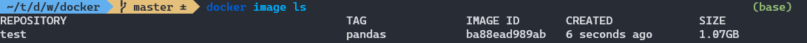
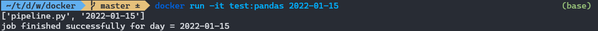

# Docker commands

With the [Dockerfile](Dockerfile) and [pipeline script](pipeline.py) in this directory, you build and run the container with the following commands.

First build the image:

```bash
docker build -t test:pandas .
```

You can check that the image was built with the following command:

```bash
docker image ls
```



Run the container with the command line argument of a date. Because the image entrypoint was defined in the Dockerfile as `["python", "pipeline.py"]`, running the container will execute the python script. The pipeline.py script will print out the `sys.argv` and a success message containing the date that was entered as the command line argument.

```bash
docker run -it test:pandas 2022-01-15
```


