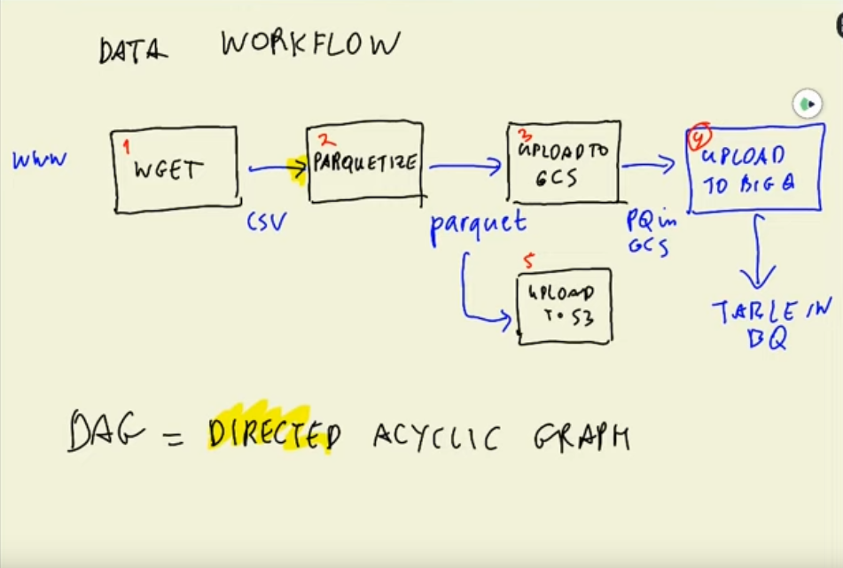

# Week 02: Data Ingestion

## Data Lakes (Google Cloud Storage)

- [Video](https://www.youtube.com/watch?v=W3Zm6rjOq70&list=PL3MmuxUbc_hJed7dXYoJw8DoCuVHhGEQb&index=14) | [Slides](https://docs.google.com/presentation/d/1RkH-YhBz2apIjYZAxUz2Uks4Pt51-fVWVN9CcH9ckyY/edit?usp=sharing)
- Data Lakes are meant to store both structured and unstructured data at unlimited scale
- It is often used to store raw or minimally processed data such as log data or sensor data
- Started as a solution for companies to store large amounts of data quickly
- ETL (extract transform load) vs. ELT (extract load transform)
  - ETL is better for smaller amounts of data, ELT is common in data lakes (schema on read)
- Contrast to a data warehouse that contains highly structured, relational data

## Workflow Orchestration

- [Video](https://www.youtube.com/watch?v=0yK7LXwYeD0&list=PL3MmuxUbc_hJed7dXYoJw8DoCuVHhGEQb&index=16)
- Our pipeline last week in the python script used wget to download the data as a csv, and then write the data to the database. Turns out this is a bad strategy
  - It's better to have each step separated in case one step fails, the entire pipeline doesn't fail
- The steps in a data pipeline can be defined as a directed acyclic graph or **DAG**
  - Directed: data flows from one step to the next
  - Acyclic: there are no cycles, data flows in one direction only
  - Graph: processing steps are the nodes, and data products are the edges
- Workflow orchestration tools such as Airflow can be used to define these **DAGs** and conduct the workflow



## Set up Airflow environment using Docker
* [Video](https://www.youtube.com/watch?v=lqDMzReAtrw&list=PL3MmuxUbc_hJed7dXYoJw8DoCuVHhGEQb&index=18)
* Airflow is a tool used to schedule and orchestrate workflows and data pipelines [Here is another good overview video](https://www.youtube.com/watch?v=QgzkB1hcq5s)
* This step is setting up the airflow environment to run on google cloud. We will use the default docker-compose.yaml from airflow with a custom dockerfile to install some dependecies including gcloud. By the end of this part of the workshop, we will be able to connect to the airflow webserver.

* To be consistent with the workshop I moved the google credentials file to this location:

    ```bash
    cd ~ && mkdir -p ~/.google/credentials/
    mv <path/to/your/service-account-authkeys>.json ~/.google/credentials/google_credentials.json
    ```

* Create an airflow sub-directory and download the airflow image
  `wget https://airflow.apache.org/docs/apache-airflow/stable/docker-compose.yaml -O airflow/docker-compose.yml`

* Set the Airflow user:

  On Linux, the quick-start needs to know your host user-id and needs to have group id set to 0. Otherwise the files created in dags, logs and plugins will be created with root user. You have to make sure to configure them for the docker-compose:

  ```
  mkdir -p ./dags ./logs ./plugins

  set AIRFLOW_UID $(id -u)
  ```

  I couldn't get this to work for me for some reason, so I hard coded my userid (1002) into the Dockerfile

* Prepare for Docker Build:
  * The default configuration of the docker-compose will not work for us because it is not configured to work with google cloud and other dependencies. We need to create a custom docker file specifying these. The docker compose file explains this:

  ```yaml
    # In order to add custom dependencies or upgrade provider packages you can use your extended image.
    # Comment the image line, place your Dockerfile in the directory where you placed the docker-compose.yaml
    # and uncomment the "build" line below, Then run `docker-compose build` to build the images.
    image: ${AIRFLOW_IMAGE_NAME:-apache/airflow:2.2.3}
    # build: .
  ```
  We also need a `requirements.txt` file that specifies the dependencies of our DAGs. Add that file with these dependencies: 
  
  ```yaml
  apache-airflow-providers-google
  pyarrow
  ```

  These will be installed in the dockerfile. Instructions to install and set up gcloud dependencies are [here](https://airflow.apache.org/docs/docker-stack/recipes.html)

  In the docker-compose file, set `AIRFLOW__CORE__LOAD_EXAMPLES` to `false`. That way airflow does not install any example dags into our directory.

  Add the following environment variables to the environment in `$airflow-common-env`. The project ID and GCS bucket were created last week.

  ```yaml
    GOOGLE_APPLICATION_CREDENTIALS: /.google/credentials/google_credentials.json
    AIRFLOW_CONN_GOOGLE_CLOUD_DEFAULT: 'google-cloud-platform://?extra__google_cloud_platform__key_path=/.google/credentials/google_credentials.json'
    GCP_PROJECT_ID: 'data-eng-zoomcamp-339102'
    GCP_GCS_BUCKET: "dtc_data_lake_data-eng-zoomcamp-339102"
  ```

  In volumes, mount the gcp credentials directory as read only:

  `- ~/.google/credentials/:/.google/credentials:ro`

  * Run `docker-compose build`
  * Run `docker-compose up airflow-init` to run the initialization step. This will run database migrations and create the first user account with the username `airflow` and the password `airflow`
  * Run `docker-compose up` to start up airflow
  * Forward the port using VSCode and connect to localhost:8080 to see the airflow webserver
  * You should now see a list of DAGs that are in the `./dags` folder

# Ingesting Data to GCP with Airflow
* [Video](https://www.youtube.com/watch?v=9ksX9REfL8w&list=PL3MmuxUbc_hJed7dXYoJw8DoCuVHhGEQb&index=19)

  ## Airflow Concepts
  Ref: https://airflow.apache.org/docs/apache-airflow/stable/concepts/overview.html

  ### Key components
  Airflow consists of several key components or services:

  * **Web server**: GUI to inspect, trigger and debug the behaviour of DAGs and tasks. Available at http://localhost:8080. This is how you interact with your dags to manually trigger them, see how they ran, and inspect errors.

  * **Scheduler**: Responsible for scheduling jobs. Handles both triggering & scheduled workflows, submits Tasks to the executor to run, monitors all tasks and DAGs, and then triggers the task instances once their dependencies are complete.

  * **Worker**: This component executes the tasks given by the scheduler.

  * **Metadata database** (postgres): Backend to the Airflow environment. Used by the scheduler, executor and webserver to store state.

  * Other components (seen in docker-compose services):
        **redis**: Message broker that forwards messages from scheduler to worker.
        **flower**: The flower app for monitoring the environment. It is available at http://localhost:5555.
        **airflow-init**: initialization service (customized as per this design)

  All these services allow you to run Airflow with CeleryExecutor. For more information, see Architecture Overview.

  ### Project Structure:

  * `./dags` - DAG_FOLDER for DAG files (use ./dags_local for the local ingestion DAG)
  * `./logs` - contains logs from task execution and scheduler.
  * `./plugins` - for custom plugins

  ### Workflow components

  * **DAG**: Directed acyclic graph, specifies the dependencies between a set of tasks with explicit execution order, and has a beginning as well as an end. (Hence, “acyclic”)
        DAG Structure: DAG Definition, Tasks (eg. Operators), Task Dependencies (control flow: >> or << )

  * **Task**: a defined unit of work (aka, operators in Airflow). The Tasks themselves describe what to do, be it fetching data, running analysis, triggering other systems, or more.
        Common Types: Operators (used in this workshop), Sensors, TaskFlow decorators
        Sub-classes of Airflow's BaseOperator

  * **DAG Run**: individual execution/run of a DAG
        scheduled or triggered

  * **Task Instance**: an individual run of a single task. Task instances also have an indicative state, which could be “running”, “success”, “failed”, “skipped”, “up for retry”, etc.
        Ideally, a task should flow from none, to scheduled, to queued, to running, and finally to success.

## Writing our own DAGs
* [Video](https://www.youtube.com/watch?v=s2U8MWJH5xA&list=PL3MmuxUbc_hJed7dXYoJw8DoCuVHhGEQb&index=20)

The resources above helped to get Airflow installed and started, but didn't really help me to know how to modify the example DAGs to fit my purpose or to write my own DAG. Watching Alexey start from scratch really helped in this video.

Some key concepts:

* Templating with Jinja:

  Airflow DAGs support templating with [Jinja](https://jinja.palletsprojects.com/en/latest/), and the dag script has access to [several parameters](https://airflow.apache.org/docs/apache-airflow/stable/templates-ref.html) from airflow to use in the templates. For our purposes, we made use of the `execution_date` parameter that provides the date the DAG run was scheduled. Note that this is the "logical date," not the date the DAG was actually run. This allows us to set up templates for the url and file names we need based on the date the DAG is scheduled. 

  ```python
  DATASET_FILE_PREFIX = "yellow_tripdata_"
  DATASET_FILE_TEMPLATE = DATASET_FILE_PREFIX + '{{ execution_date.strftime(\'%Y-%m\') }}.csv'
  DATASET_URL = f"https://s3.amazonaws.com/nyc-tlc/trip+data/{DATASET_FILE_TEMPLATE}"
  PARQUET_FILE = DATASET_FILE_TEMPLATE.replace('.csv', '.parquet')
  ```

* Schedule interval:
  The DAG `schedule_interval` defines how often it will be run. There are several built in options like `@daily` or `@monthly` which will run at midnight (UTC) each night or on the first night of the month. You can also define it with a chron expression. Use [chrontab guru](https://crontab.guru/) to write and test the expression. 

* Inspecting a worker:
  Sometimes a task will fail. You can click on the failed task in the tree (click the little red square). This will open a dialog and you can check the logs there. Often this will be enough to figure out where the task went wrong. Sometimes you will need to look in the file structure of the worker to see what is going on. Use `docker ps` to get the container id of the worker container, and then exec into the container with bash using the following command: 

  ```
  docker exec -it <container-id> bash
  ```

