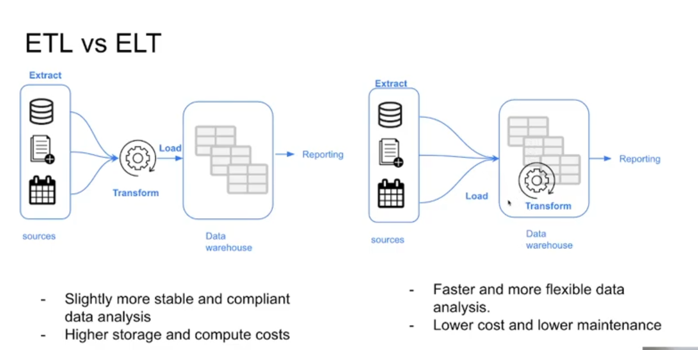

# Week 4: Analytics Engineerng

Videos:
[Analytics Engineering Basics](https://www.youtube.com/watch?v=uF76d5EmdtU&list=PL3MmuxUbc_hJed7dXYoJw8DoCuVHhGEQb&index=34)

## Analytics Engineering basics

*  Analytics engineering bridges the gap between data engineers, who are good software engineers who may not know how the data will be used, and data analysts, who are very familiar with the data but typically not as experienced at software engineering
* Analytics engineers are concerned with data modeling in the data warehouse with tools like dbt or Dataform and data presentation with tools like Looker, Mode, or Tableau

### Data Modelling Concepts

* **ETL vs ELT**

  * **ETL** - Extract transform load - Transform the data before loading it into the data warehouse
  * **ELT** - Extract load transform - Use the compute within the data warehouse to transform the data



* Kimballs Dimensional Modeling
  * Deliver data that is understandable to the end user, but also optimize query performance
  * Does not prioritize non-redundant data
  * other approaches to compare to are Bill Immon or Data vault
  * Elements:
    * Fact tables - contain metrics, facts, or measurements. correspond to a business process. Think of verbs
    * Dimensions tables - correspond to business entity, provides contect to a business process. think of nouns
    * A fact table is usually "surrounded" by many dimension tables. This is referred to as a **Star Schema**
  * Architecture:
    * Staging area - raw data, only exposed to data or analytics engineers who know what to do with it. Think of raw ingrediant storage in a restaurant
    * Processing area - this is where raw data is modeled. Think of the kitchen in a restaurant
    * Presentation area - exposed to the business users. Think of the dining area in a restaurant

### What is dbt
[Video](https://www.youtube.com/watch?v=4eCouvVOJUw&list=PL3MmuxUbc_hJed7dXYoJw8DoCuVHhGEQb&index=35)
* dbt or data build tool is a tool for transforming raw data that has been loaded into a warehouse so it can be exposed to BI applications or other business data consumers
* it works by defining *models* as sql files that contain SELECT statements. dbt will compile the data and push the compute to the DW
*  **dbt Core** Open source tool that allows for data transformation. Builds and runs the dbt project, includes SQL compilation logic, and a CLI to run dbt commands locally
* **dbt CLoud** SaaS application to develop and maintain dbt projects. Free for individuals
* For our class with the Big Query data warehouse, we will develop using the dbt cloud IDE.In Big Query. For postgres local database you will need to install dbt locally and connect it to the postgres db

### Creating a dbt project from the beginning
* This workshop requires green taxi data for 2019 and 2020 which I had not uploaded to the data warehouse yet. I needed to modify the dags to do so.
    * I copy-pasted the [`yellow_taxi_ingestion_dag.py`](week03/airflow/dags/yellow_taxi_ingestion_dag.py) and created [`green_taxi_ingestion_dag.py`](week03/airflow/dags/green_taxi_ingestion_dag.py). A better practice would be to parameterize the single dag to read in fhv, yellow, and green taxi data. Maybe I will re-factor this at some point. 
    * I did refacor and parameterize the `gcs_to_bq.py` dag but ran into issues because one of the columns (`ehail_fee`) in the green taxi data contains some null values, but the parquet file treated them as ints rather than floats. I took the advice of someone on slack and simply did not upload that column to the partitioned table by using an `EXCEPT` statement. Hopefully we don't need it!
* I created an account for dbt Cloud and created service account credentials in cloud console with access to big query. I also created a new [repository](https://github.com/mharty3/dbt_project_DEZC_2022) to hold the dbt project and added a deploy key to allow dbt Cloud to push code to the repo
* I defined a schema for the staging area in the dwh that will house staging views:

    ```yml
    version: 2

    sources:
        - name: staging
          database: data-eng-zoomcamp-339102
          schema: trips_data_all

          tables:
            - name: green_tripdata_partitoned
            - name: yellow_tripdata_partitoned
    ```

   and generated an intial query using jinja templating.

   ```python
   {{ config(materialized='view') }}

    select * from {{ source('staging', 'green_tripdata_partitoned') }}

    limit 100
    ```


    
* Running the model gave me an error because dbt tried creating a new schema on my bq called `dbt_mharty` in multi-region US, which is different from the trips_data_all_schema:
`404 Not found: Dataset data-eng-zoomcamp-339102:trips_data_all was not found in location US`
This was fixed by deleting the schema in the google cloud console and then re-creating it with the same name and defining the location to be the same as the location of my `trips_data_all` schema. (`us-central1`). dbt created the schema using default location and it was wrong.