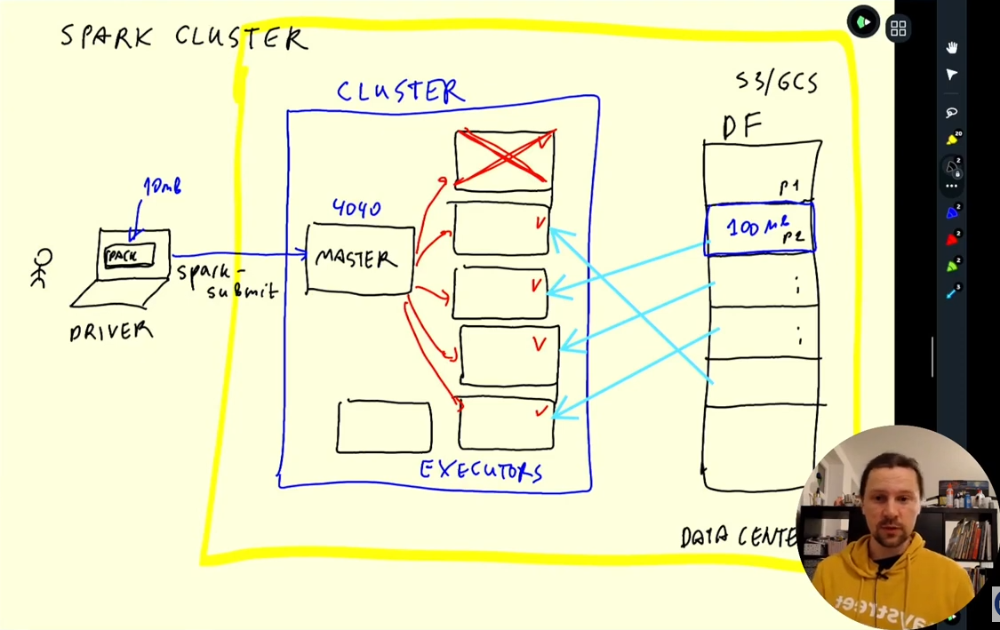

# Week 5: Batch Processing

## Batch vs Streaming

[Video: Introduction to Batch Processing](https://www.youtube.com/watch?v=dcHe5Fl3MF8&list=PL3MmuxUbc_hJed7dXYoJw8DoCuVHhGEQb)

* A batch job is a job that takes data for an entire time period (1 day, 1 hour etc) and runs a job to process it
* In contrast, a streaming data process processes data as events happen for example, as a taxi rider is picked up an event is created and processed in a data stream.
* Key technologies for batch jobs:
  * python, like week 1
  * SQL, like week 4
  * Spark
  * Flink
* Batch jobs can be run in Kubernetes, VM, AWS Batch etc
* Typically they are orchestrated with Airflow
* Advantages:
  * Easier to manage (jobs can be retried if failed)
  * Can scale easier
* Disadvangates:
  * Takes time to process the data. If data is processed every hour, and the process takes 20 minutes, you will have to wait 90 minutes until the data is processed from when it is created.
  * Often this is not a concern because most metrics are not that time sensitive, but it can be solved with streaming
* Most jobs in industry are batch jobs (maybe 80%)

## Intro to Apache Spark

[Video: Introduction to Spark](https://www.youtube.com/watch?v=dcHe5Fl3MF8&list=PL3MmuxUbc_hJed7dXYoJw8DoCuVHhGEQb)

* Apache Spark is an open-source unified analytics engine for large-scale data processing. Spark provides an interface for programming entire clusters with implicit data parallelism and fault tolerance
* Multi-language. Originally written in Scala, but Pyspark (python) is very common 
* Typically it is used when data is stored in a data lake, spark will read in parquet files, do some processing, and write it back in to the data lake
* Solutions like Hive or Presto/Athena can allow you to use SQL in the data lake. That solution is often better than Spark. When it is not possible, (in machine learning for example), use spark

## Installing Spark on Linux
[Video](https://www.youtube.com/watch?v=hqUbB9c8sKg&list=PL3MmuxUbc_hJed7dXYoJw8DoCuVHhGEQb&index=49)
[Instructions](https://github.com/DataTalksClub/data-engineering-zoomcamp/blob/main/week_5_batch_processing/setup/linux.md)

* Install Java Open JDK 11. Spark requires version 8 or 11. Note, this is not the most recent version of Java!
  
  ```bash
  mkdir spark
  cd spark
  wget https://download.java.net/java/GA/jdk11/9/GPL/openjdk-11.0.2_linux-x64_bin.tar.gz
  tar xzfv openjdk-11.0.2_linux-x64_bin.tar.gz
  rm openjdk-11.0.2_linux-x64_bin.tar.gz
  export JAVA_HOME="$HOME/spark/jdk-11.0.2"
  export PATH="$JAVA_HOME/bin:$PATH"
  ```

* Install Spark

  ```bash
     wget https://dlcdn.apache.org/spark/spark-3.0.3/spark-3.0.3-bin-hadoop3.2.tgz
     tar xzfv spark-3.0.3-bin-hadoop3.2.tgz
     rm spark-3.0.3-bin-hadoop3.2.tgz
     export SPARK_HOME="$HOME/spark/spark-3.0.3-bin-hadoop3.2"
     export PATH="$SPARK_HOME/bin:$PATH"
  ```

* Run `spark-shell.`  There are some warnings, but we can ignore them. This will open a scala prompt.

* add the following to .bashrc

  ```bash
  export JAVA_HOME="${HOME}/spark/jdk-11.0.2"
  export PATH="${JAVA_HOME}/bin:${PATH}"
  export SPARK_HOME="${HOME}/spark/spark-3.0.3-bin-hadoop3.2"
  export PATH="${SPARK_HOME}/bin:${PATH}"
  ```

## Using Pyspark
[Instructions](https://github.com/DataTalksClub/data-engineering-zoomcamp/blob/main/week_5_batch_processing/setup/pyspark.md)
  * Update the Python Path for Pyspark

  ```bash
  export PYTHONPATH="$SPARK_HOME/python/:$PYTHONPATH"
  export PYTHONPATH="$SPARK_HOME/python/lib/py4j-0.10.9-src.zip:$PYTHONPATH"
  ```

* create a directory for the example, download a csv for testing, and run jupyter notebook. Use vs code to forward port 8080 from the VM.
  ```bash
  mkdir spark_example
  cd spark_example
  wget https://s3.amazonaws.com/nyc-tlc/misc/taxi+_zone_lookup.csv
  jupyter notebook
  ```

* Test out pyspark in the notebook

```python
import pyspark
from pyspark.sql import SparkSession

spark = SparkSession.builder \
    .master("local[*]") \
    .appName('test') \
    .getOrCreate()

df = spark.read \
    .option("header", "true") \
    .csv('taxi+_zone_lookup.csv')

df.show()
```

Also test writing files

```python
df.write.parquet('zones')
```

* Also forward port 4040 using vs code to see the Spark Jobs that have been run in the spark master UI

## First look at Pyspark
[Video](https://www.youtube.com/watch?v=r_Sf6fCB40c&list=PL3MmuxUbc_hJed7dXYoJw8DoCuVHhGEQb&index=50)

* Reading csv files, partitioning data frames for more efficient processing by the workers, writing to parquet files

See the notebook [here](code/pyspark_firstlook.ipynb)

## Spark Data Frames
[Video](https://www.youtube.com/watch?v=ti3aC1m3rE8&list=PL3MmuxUbc_hJed7dXYoJw8DoCuVHhGEQb&index=51)

* See the notebook linked above
* A key benefit of spark is that it is more flexible than SQL. It has user defined functions (udf) you can use more complicated logic than SQL. Complex python code is also easier to maintain and test.
* Defining udfs in SQL in the data warehouse can be cumbersome

## SQL With Spark
[Video](https://www.youtube.com/watch?v=uAlp2VuZZPY&list=PL3MmuxUbc_hJed7dXYoJw8DoCuVHhGEQb&index=53)

* Download the yellow and green taxi data for 2020 and 2021. There is a bash script and a notebook to run to download all of the csvs and convert them to parquet files.
* This [notebook](week05/code/06_pyspark_sql.ipynb) demonstrates how you can execute SQL using spark
* It also shows how to write parquet files using `coalesce` which is the opposite of `repartition`
* Reading and writing files like this allows us to use spark inside of the data lake without having to load the data to the data warehouse

## Spark Internals
[Video](https://www.youtube.com/watch?v=68CipcZt7ZA&list=PL3MmuxUbc_hJed7dXYoJw8DoCuVHhGEQb&index=54)
* So far we have only used spark "locally." We have been using the following code to set up the session. Notice the `.master("local[*]"). More typically, spark jobs are submtted from a driver on your laptop or Airflow worker to a cluster running on the cloud.

```python
spark = SparkSession.builder \
    .master("local[*]") \
    .appName('test') \
    .getOrCreate()
```  
 

* The cluster consists of several node computers, the first is the *master* which is in charge of coordinating the work among all of the *executor* nodes. If one executor fails, the master can reassign the task to a different executor.
* Dataframes are typically stored in parquet files in the same data center (S3 or GCP) as the cluster so file transfer is very fast. This is in contrast to Hadoop archetecture which stored the data on the executors. Hadoop is not as popular as it used to be

## GroupBy in Spark
[Video](https://www.youtube.com/watch?v=68CipcZt7ZA&list=PL3MmuxUbc_hJed7dXYoJw8DoCuVHhGEQb&index=55)
* Because data is partitioned among clusters in spark, GroupBy must take place in two stages.
* First data within each partition is grouped and aggregated producting an intermediate result from each partition


* The second step is a *reshuffling* step where data in the intermedidate results is shuffled around to be sure the all instances of a given key of the groupby are present on the same partition. The algorithm to do this is called *external merged sort*. Then each partition is grouped again


## Joins in Spark
[Video](https://www.youtube.com/watch?v=lu7TrqAWuH4&list=PL3MmuxUbc_hJed7dXYoJw8DoCuVHhGEQb&index=56)
* Joins require a similar phase of reshuffling to group by. Records with the same join key(s) are reshuffled to be on the same partition, and then each partition is reduced in the join step

* Joining a small table to a large table is much faster than joining two large tables because in this case, merge sort is not required. Each executor gets a copy of the smaller table and can lookup the join value and append to each record

